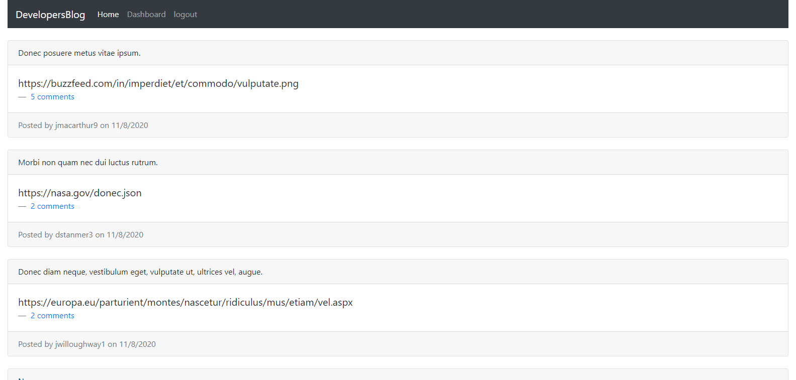

# Developers-blog

### License:
  

## Description 
A CMS-style blog site where developers can publish their blog posts and comment on other developers’ posts as well.

## Installation
* clone the application repo: "https://github.com/johngeorge88/developers-blog"
* Run (npm install) to install all the dependencies.

## Deployed Application:
Application link: <a href="https://guarded-refuge-20906.herokuapp.com/">Click here</a>

## Appllication screenshot
